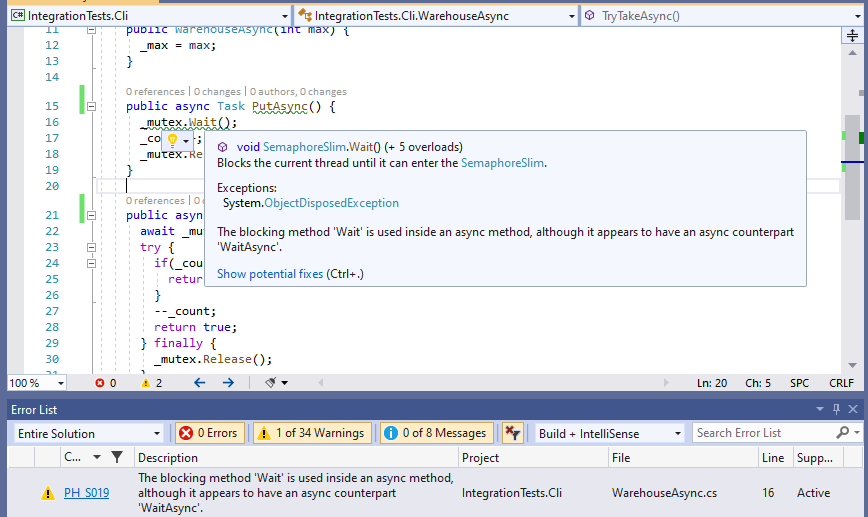

# Parallel Helper

[](https://ci.appveyor.com/project/camrein/parallelhelper/branch/master)
[](https://codecov.io/gh/Concurrency-Lab/ParallelHelper/branch/master)

*Parallel Helper* is a static code analyzer for C# projects that supports the development of parallel and asynchronous code. The analyzer is built with the help of the [.NET Compiler Platform (Roslyn)](https://github.com/dotnet/roslyn) and is available as a [NuGet package](https://www.nuget.org/packages/ParallelHelper/) as well as a [Visual Studio extension](https://marketplace.visualstudio.com/items?itemName=camrein.ParallelHelper).



## Getting Started

After the successful installation of *Parallel Helper*, it automatically scans the currently open files.

### Visual Studio Extension

For issue reports for all available documents within *Visual Studio*, it is necessary to enable the full solution analysis:

1. Open the Visual Studio options dialog via *Tools* -> *Options*.
2. Navigate to the C# Advanced Settings via *Text Editor* -> *C#* -> *Advanced* -> or just type *Full Solution Analysis* into the search field.
3. Tick the option *Enable full solution analysis* in the *Analysis* property group.

### NuGet Package

A complete rebuild of the solution should yield potential issues for all available documents. For Visual Studio users, enabling the *Full Solution Analysis* option, as described in the *Visual Studio Extension* section, is also possible.

### Visual Studio Code

*VS Code* requires the [C# extension](https://marketplace.visualstudio.com/items?itemName=ms-vscode.csharp) as well as the installation of *Parallel Helper* as a NuGet package into the desired projects. After the installation, it is necessary to enable the Roslyn analyzers support of the C# extension. One way to enable the analyzers is through the *VS Code* settings page by ticking the option *Omnisharp: Enable Roslyn Analyzers*.

## Issue Classes

There are currently three classes of issues:

- Best Practices (PH_P...)
- Smells (PH_S...)
- Bugs (PH_B...)

*Best Practices* are opinionated practices to make the code more robust.

*Smells*, on the other hand, denote code constellations that break commonly accepted contracts that may lead to unexpected behavior when used by 3rd parties. Moreover, missuses of specific APIs or if some APIs are more suitable for the present case are also considered a code smell.

Last but not least, the class *Bugs* represents the most severe of the reported issues. *Parallel Helper* reports this class when there is a high chance of a concurrency related problem, such as race conditions.

## Issue Reports

Most of the reported issues have a default severity of *warning* or *suggestion*. Nevertheless, some issues are *silent* because either they are too strict or their underlying pattern is not considered production-ready yet.

The following issues are *Hidden* by default:

- [PH_P004](doc/analyzers/PH_P004.md) - CancellationToken not Passed Through (this analysis is covered by [PH_P007](doc/analyzers/PH_P007.md))
- [PH_P005](doc/analyzers/PH_P005.md) - Missing Gate-Keeper
- [PH_P010](doc/analyzers/PH_P010.md) - Async Instead of Continuation
- [PH_S004](doc/analyzers/PH_S004.md) - Fire-and-forget Threads
- [PH_S006](doc/analyzers/PH_S006.md) - Unnecessarily Async Methods
- [PH_S008](doc/analyzers/PH_S008.md) - Timer Scheduled upon Instantiation

To enable reporting of one or more of the above issues, add an entry like the following one to the *.editorconfig* file (does not work for Visual Studio 2017).

```ini
# PH_S004: Fire-and-forget Threads
dotnet_diagnostic.PH_S004.severity = suggestion
```

The same method allows changing the severity of any of the reported issues. The possible severities are *none*, *silent*, *suggestion*, *warning*, and *error*. See the Microsoft documentation about [severity levels](https://docs.microsoft.com/en-us/visualstudio/ide/editorconfig-language-conventions?view=vs-2019#severity-levels) for more details. You may also take a look at the [example .editorconfig](reportall.editorconfig) that sets all analyzers to *warning* and makes them the least conservative.

Alternatively, an entry to the *CodeAnalysis.ruleset* file has the same effect.

```xml
<?xml version="1.0" encoding="utf-8"?>
<RuleSet Name="My Rule Set" Description=" " ToolsVersion="15.0">
  <Rules AnalyzerId="ParallelHelper" RuleNamespace="ParallelHelper">
    <Rule Id="PH_S004" Action="Info" /> <!-- Fire-and-forget Threads -->
  </Rules>
</RuleSet>
```

See the Microsoft documentation about [Rule sets](https://docs.microsoft.com/en-us/visualstudio/code-quality/using-rule-sets-to-group-code-analysis-rules?view=vs-2019) for more details.

## Documentation

The [documentation](doc/analyzers/) directory contains a list of all issues that *Parallel Helper* currently reports. Each issue has a summary of the problem that may arise — additionally, a suggestion on how to resolve said issue.

## Quick Test

To quickly test and evaluate the functionality of *Parallel Helper*, get the *IntegrationTests* sample project available in the [test](test/) directory. This project consists of various concurrency related issues.

## FAQ

### Why do I get more issues after fixing one?

Issues are not mutually exclusive. After fixing one issue, the code may have a structure that is better recognizable by another analyzer. It is a design choice of *Parallel Helper* to keep the analysis implementations as simple as possible. Therefore, the analyzers are not only exceptionally fast but also less prone to false positives.

### Why do I have multiple issues at the same location?

*Parallel Helper* consists of various analyzers, each is made to recognize a specific code constellation. Therefore, if *Parallel Helper* reports multiple issues at the same location, this means there is a high chance for a fundamental issue.

## Additional Notes

Because of *Parallel Helper*'s conservative design, there is a chance of false positives, although the goal is to keep the false positive number small. Therefore, there is also a chance of false negatives. There is no guarantee that there are no concurrency problems if *Parallel Helper* does not report any issues.

*Parallel Helper* focuses on issues on a higher semantic level; thus, it generally does not report issues such as data races, although they might be part of another problem. If a thorough data race analysis is desirable, consider the use of the Visual Studio extension [Parallel Checker](https://marketplace.visualstudio.com/items?itemName=LBHSR.HSRParallelCheckerforC7VS2017).
